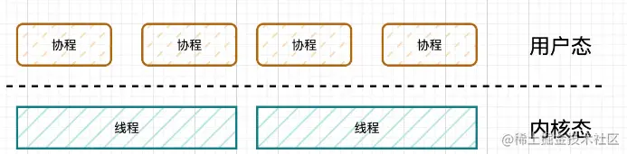

# [字节跳动青训营](https://github.com/mao888/golang-guide/blob/main/golang/go-study/%E7%AC%AC%E4%BA%94%E5%B1%8A%E5%AD%97%E8%8A%82%E8%B7%B3%E5%8A%A8%E9%9D%92%E8%AE%AD%E8%90%A5/%E3%80%90%E5%90%8E%E7%AB%AF%E4%B8%93%E5%9C%BA%20%E5%AD%A6%E4%B9%A0%E8%B5%84%E6%96%99%E4%B8%80%E3%80%91%E7%AC%AC%E4%BA%94%E5%B1%8A%E5%AD%97%E8%8A%82%E8%B7%B3%E5%8A%A8%E9%9D%92%E8%AE%AD%E8%90%A5.md)

## Go-工程进阶
**概述**
主要分为四个方面
- 并发编程
- 依赖管理
- 单元测试
- 项目实战

### 并发编程
#### 协程Goroutine

#### 通道Channel 
#### 锁Lock pkg.go.dev/sync
#### 线程同步WaitGroup pkg.go.dev/sync